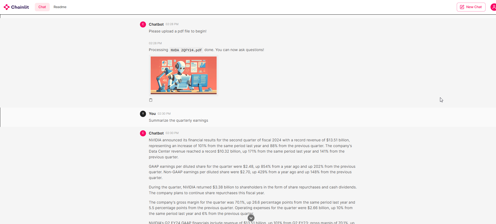

# PDF Chatbot Powered by Chainlit
## Summary
This full end-to-end project culminates in a chatbot that can answer questions from a source material. The application is configured to prompt the user to upload a PDF. The user then can ask any questions concerning contents in the PDF and the chatbot will answer accordingly.

Opening page:

Answer following PDF read and user prompt: 

## Technology Stack
1. Python
2. Chainlit
3. Groq
4. Langchain